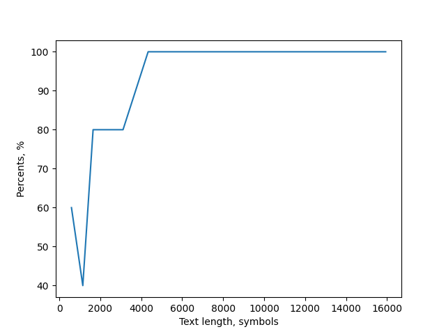
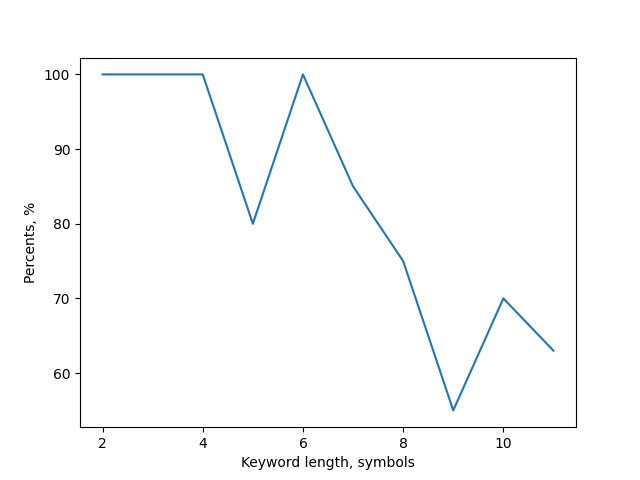

# Lgramm length 3
## Matching the length of the initial key with the length of the key found using the kasiski method.
|Text length|me|sum|marx|crack|cherry|scratch|solution|injection|permission|nationalism|
|---|---|---|---|---|---|---|---|---|---|---|
|596|**+**|**+**|**+**|**+**|**+**|**+**|**+**|**+**|**+**|**+**|
|1150|**+**|**+**|**+**|**+**|**+**|**+**|**+**|**+**|**+**|**+**|
|1652|**+**|**+**|**+**|**+**|**+**|**+**|**+**|**+**|**+**|**+**|
|2007|**+**|**+**|**+**|**+**|**+**|**+**|**+**|**+**|**+**|**+**|
|3113|**+**|**+**|**+**|**+**|**+**|**+**|**+**|**+**|**+**|**+**|
|4339|**+**|**+**|**+**|**+**|**+**|**+**|**+**|**+**|**+**|**+**|
|6435|**+**|**+**|**+**|**+**|**+**|**+**|**+**|**+**|**+**|**+**|
|10491|**+**|**+**|**+**|**+**|**+**|**+**|**+**|**+**|**+**|**+**|
|12651|**+**|**+**|**+**|**+**|**+**|**+**|**+**|**+**|**+**|**+**|
|15937|**+**|**+**|**+**|**+**|**+**|**+**|**+**|**+**|**+**|**+**|
## The percentage of the match of the original and found key.
|Text length|me|sum|marx|crack|cherry|scratch|solution|injection|permission|nationalism|
|---|---|---|---|---|---|---|---|---|---|---|
|596|**100**|66|50|60|50|57|50|55|50|36|
|1150|50|33|75|40|50|42|37|44|10|27|
|1652|**100**|**100**|**100**|**80**|**100**|**85**|75|55|70|63|
|2007|**100**|66|**100**|**80**|66|57|75|77|60|72|
|3113|**100**|**100**|**100**|**80**|**100**|57|**87**|77|60|63|
|4339|**100**|66|50|**100**|66|71|50|66|60|**81**|
|6435|**100**|**100**|**100**|**100**|**100**|**100**|**100**|**100**|**100**|**100**|
|10491|**100**|**100**|**100**|**100**|**100**|**85**|**87**|**100**|**90**|**100**|
|12651|**100**|**100**|**100**|**100**|**100**|**100**|**100**|**100**|**100**|**90**|
|15937|**100**|**100**|**100**|**100**|**100**|**100**|**100**|77|**90**|**90**|
# Lgramm length 4
## Matching the length of the initial key with the length of the key found using the kasiski method.
|Text length|me|sum|marx|crack|cherry|scratch|solution|injection|permission|nationalism|
|---|---|---|---|---|---|---|---|---|---|---|
|596|**+**|**+**|**+**|**+**||**+**|**+**|**+**||**+**|
|1150|**+**|**+**|**+**|**+**|**+**|**+**|**+**|**+**|**+**|**+**|
|1652|**+**|**+**|**+**|**+**|**+**|**+**|**+**|**+**|**+**|**+**|
|2007|**+**|**+**|**+**|**+**|**+**|**+**|**+**|**+**|**+**|**+**|
|3113|**+**|**+**|**+**|**+**|**+**|**+**|**+**|**+**|**+**|**+**|
|4339|**+**|**+**|**+**|**+**|**+**|**+**|**+**|**+**|**+**|**+**|
|6435|**+**|**+**|**+**|**+**|**+**|**+**|**+**|**+**|**+**|**+**|
|10491|**+**|**+**|**+**|**+**|**+**|**+**|**+**|**+**|**+**|**+**|
|12651|**+**|**+**|**+**|**+**|**+**|**+**|**+**|**+**|**+**|**+**|
|15937|**+**|**+**|**+**|**+**|**+**|**+**|**+**|**+**|**+**|**+**|
## The percentage of the match of the original and found key.
|Text length|me|sum|marx|crack|cherry|scratch|solution|injection|permission|nationalism|
|---|---|---|---|---|---|---|---|---|---|---|
|596|**100**|66|50|60|33|57|50|55|Fail|36|
|1150|50|33|75|40|50|42|37|44|10|27|
|1652|**100**|**100**|**100**|**80**|**100**|**85**|75|55|70|63|
|2007|**100**|66|**100**|**80**|66|57|75|77|60|72|
|3113|**100**|**100**|**100**|**80**|**100**|57|**87**|77|60|63|
|4339|**100**|66|50|**100**|66|71|50|66|60|**81**|
|6435|**100**|**100**|**100**|**100**|**100**|**100**|**100**|**100**|**100**|**100**|
|10491|**100**|**100**|**100**|**100**|**100**|**85**|**87**|**100**|**90**|**100**|
|12651|**100**|**100**|**100**|**100**|**100**|**100**|**100**|**100**|**100**|**90**|
|15937|**100**|**100**|**100**|**100**|**100**|**100**|**100**|77|**90**|**90**|
# Lgramm length 5
## Matching the length of the initial key with the length of the key found using the kasiski method.
|Text length|me|sum|marx|crack|cherry|scratch|solution|injection|permission|nationalism|
|---|---|---|---|---|---|---|---|---|---|---|
|596||**+**|**+**|**+**||**+**||||**+**|
|1150|**+**|**+**|**+**|**+**|**+**|**+**|**+**|**+**|**+**|**+**|
|1652|**+**|**+**|**+**|**+**|**+**|**+**|**+**|**+**|**+**|**+**|
|2007|**+**|**+**|**+**|**+**|**+**|**+**|**+**|**+**|**+**|**+**|
|3113|**+**|**+**|**+**|**+**|**+**|**+**|**+**|**+**|**+**|**+**|
|4339|**+**|**+**|**+**|**+**|**+**|**+**|**+**|**+**|**+**|**+**|
|6435|**+**|**+**|**+**|**+**|**+**|**+**|**+**|**+**|**+**|**+**|
|10491|**+**|**+**|**+**|**+**|**+**|**+**|**+**|**+**|**+**|**+**|
|12651|**+**|**+**|**+**|**+**|**+**|**+**|**+**|**+**|**+**|**+**|
|15937|**+**|**+**|**+**|**+**|**+**|**+**|**+**|**+**|**+**|**+**|
## The percentage of the match of the original and found key.
|Text length|me|sum|marx|crack|cherry|scratch|solution|injection|permission|nationalism|
|---|---|---|---|---|---|---|---|---|---|---|
|596|50|66|50|60|33|57|Fail|Fail|Fail|36|
|1150|50|33|75|40|50|42|37|44|10|27|
|1652|**100**|**100**|**100**|**80**|**100**|**85**|75|55|70|63|
|2007|**100**|66|**100**|**80**|66|57|75|77|60|72|
|3113|**100**|**100**|**100**|**80**|**100**|57|**87**|77|60|63|
|4339|**100**|66|50|**100**|66|71|50|66|60|**81**|
|6435|**100**|**100**|**100**|**100**|**100**|**100**|**100**|**100**|**100**|**100**|
|10491|**100**|**100**|**100**|**100**|**100**|**85**|**87**|**100**|**90**|**100**|
|12651|**100**|**100**|**100**|**100**|**100**|**100**|**100**|**100**|**100**|**90**|
|15937|**100**|**100**|**100**|**100**|**100**|**100**|**100**|77|**90**|**90**|
### *The longer the l-gramm, the higher the risk of not finding it, so finding the key length becomes impossible.*
### *In general, we see that with small keys and an increase in the length of the text, the text selection is more like a natural one, so the keyword is restored quite successfully and vice versa*
## Fixed keyword length
|Text length|Keyword|Key length|Found keyword|Found key length|Match|
|---|---|---|---|---|---|
|596|crack|5|ceaqk|5|60%|
|1150|crack|5|gragg|5|40%|
|1652|crack|5|rrack|5|80%|
|2007|crack|5|cgack|5|80%|
|3113|crack|5|rrack|5|80%|
|4339|crack|5|crack|5|100%|
|6435|crack|5|crack|5|100%|
|10491|crack|5|crack|5|100%|
|12651|crack|5|crack|5|100%|
|15937|crack|5|crack|5|100%|

## Fixed text length
|Text length|Keyword|Key length|Found keyword|Found key length|Match|
|---|---|---|---|---|---|
|1652|me|2|me|2|100%|
|1652|sum|3|sum|3|100%|
|1652|marx|4|marx|4|100%|
|1652|crack|5|rrack|5|80%|
|1652|cherry|6|cherry|6|100%|
|1652|scratch|7|scrwtch|7|85%|
|1652|solution|8|foljtion|8|75%|
|1652|injection|9|enyegtioa|9|55%|
|1652|permission|10|parmvhsion|10|70%|
|1652|nationalism|11|natvonaaehm|11|63%|

# Key points:
 1. Longer l-gramms may offer better choices because these matches are less likely to be by chance.
 2. But the longer it is, the higher the risk that it will simply not be found in the text.
 3. Since a distance may be a multiple of the keyword length, a factor of a distance may be the length of the keyword. If a match is by pure chance, the factors of this distance may not be factors of the keyword length. In general, a good choice is the largest one that appears most often. 
 4. To decrypt the text, knowing the length of the key, substrings are selected from each n-th (n = len(key)) letter. Such a text does not demonstrate the expected distribution of letter frequencies. The situation may be aggravated by such a distortion of texts, such as: did not -> didn't
 5. In addition, the longer the keyword, the sample is not only smaller, but also less representative (the set of letters does not look like a natural text)
 6. Thus, the program successfully implements finding the key length for the text encrypted with the Vigenere cipher, but frequency analysis reduces the degree of success of key recovery.
